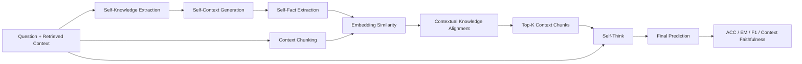

# FaithfulRAG：知识冲突与上下文忠实生成复现

> Knowledge Conflict · Context Faithfulness · Self-Fact Mining · Contextual Knowledge
> Alignment · Self-Think · RAG Evaluation

[](https://aclanthology.org/2025.acl-long.1062/)
[](https://huggingface.co/meta-llama/Llama-3.1-8B-Instruct)
[](https://github.com/SikiLee/FaithfulRAG)
[](environment.yml)

本项目围绕检索上下文与模型参数知识冲突导致的非忠实生成问题，复现 FaithfulRAG 的
Self-Fact Mining、Contextual Knowledge Alignment 与 Self-Think 三阶段流程，并构建统一的
数据、推理、评估、消融和错误分析工程。

项目基于 Meta-Llama-3.1-8B-Instruct，在知识一致与知识冲突场景下比较 Vanilla RAG、上下文
提示增强、无 CoT 与分阶段 CoT。实验表明，FaithfulRAG 能够更有效地识别事实级冲突，降低
参数知识覆盖和上下文忽略，提高冲突场景中的回答准确率与上下文忠实度。

## 核心工作

- 复现 **Self-Fact Mining → Contextual Knowledge Alignment → Self-Think** 三阶段流程，跟踪
  dataset sample 从知识外化、事实抽取、context chunking、embedding similarity、Top-K 对齐，
  到最终生成与评估的完整执行路径。
- 基于官方数据构建知识一致、知识冲突样本各 600 条，固定样本 ID、随机种子、数据哈希与
  negative/golden 配对关系。
- 对比 Vanilla RAG、上下文提示增强、无 CoT 与分阶段 CoT，统一 backbone、context budget、
  generation 参数和 evaluator，保证对比条件一致。
- 封装 OpenAI、Hugging Face 与 vLLM 推理后端，支持异步批处理、并发控制、阶段结果缓存、
  checkpoint/resume、实验日志和异常保存。
- 实现 Full Context、FaithfulRAG、w/o Self-Fact Mining、w/o Self-Think 等实验，并结合消融与
  prediction-level trace 分析不同模块对上下文忠实性的贡献。
- 通过模块消融和错误分析定位 Context Ignorance、Parametric Knowledge Override 与 Fact
  Conflict Mixing 三类典型失败模式。

## 方法流程



### 1. Self-Fact Mining

Self-Fact Mining 将模型参数知识外化为可比较的事实单元：

1. **Self-Knowledge Extraction**：生成回答问题所需的模型内部知识；
2. **Self-Context Generation**：将内部知识扩展为结构化 self-context；
3. **Self-Fact Extraction**：从 self-context 中抽取事实列表，为后续冲突对齐提供原子事实。

### 2. Contextual Knowledge Alignment

- 使用 NLTK 对检索上下文分句，并按 `chunk_size=20` 聚合上下文 chunks；
- 使用 `all-MiniLM-L6-v2` 编码 self-facts 与 context chunks；
- 通过 cosine similarity 为每个 fact 检索候选 chunks；
- 对候选结果全局排序、去重，保留 Top-5 contextual chunks；
- 将参数知识与外部上下文中的一致或冲突事实显式对齐。

### 3. Self-Think

Self-Think 使用结构化分阶段推理：

- `[Fact Analysis]`：分析内部事实与上下文事实；
- `[Option Matching]`：建立事实与候选答案的对应关系；
- `[Context Check]`：确认答案是否遵循检索上下文；
- `[Final Verification]`：检查事实冲突处理与最终结论。

## 实验设置

### Backbone 与 embedding

| Component | Configuration |
|---|---|
| Backbone | `meta-llama/Llama-3.1-8B-Instruct` |
| Embedding | `sentence-transformers/all-MiniLM-L6-v2` |
| Inference backends | OpenAI / Hugging Face / vLLM |
| Temperature | `0.0` |
| Top-p | `1.0` |
| Chunk size | `20` |
| Sentence top-k | `5` |
| Final chunk top-k | `5` |
| Max new tokens | `1000` |
| Seed | `42` |

### 数据构造

| Split | Samples | Description |
|---|---:|---|
| Knowledge-consistent | 600 | 检索上下文与模型参数知识一致 |
| Knowledge-conflict | 600 | 检索上下文包含与模型参数知识冲突的替换事实 |
| Total | 1200 | 固定 ID、顺序、数据哈希和评估配置 |

### 对比方法

| Method | Description |
|---|---|
| Vanilla RAG | 直接将完整检索上下文输入模型 |
| Context-enhanced Prompting | 通过显式指令要求模型优先遵循检索上下文 |
| w/o CoT | 完成事实挖掘与对齐后直接生成答案 |
| Staged CoT / FaithfulRAG | 完整 Self-Fact Mining、alignment 与分阶段 Self-Think |

## 核心结果

在知识冲突样本上，FaithfulRAG 相比 Vanilla RAG 显著提升回答准确率和上下文忠实度：

| Method | ACC | Context Faithfulness |
|---|---:|---:|
| Vanilla RAG | 58.4% | 0.63 |
| FaithfulRAG | **72.6%** | **0.79** |
| Improvement | **+14.2 pp** | **+0.16** |

结果表明，显式建模参数知识与检索上下文的事实级冲突，能够缓解模型在冲突上下文中依赖参数
记忆的问题；分阶段 Self-Think 进一步提升了模型对上下文事实的验证和服从能力。

## 消融实验

| Ablation | Removed capability | Purpose |
|---|---|---|
| Full FaithfulRAG | — | 完整三阶段方法 |
| w/o Self-Fact Mining | 知识外化、self-context 和事实抽取 | 验证显式事实建模的贡献 |
| w/o Self-Think | 分阶段事实分析与最终验证 | 验证结构化推理的贡献 |
| Full Context | Self-Fact Mining、alignment、Self-Think | 对比原始 RAG 行为 |

消融结果显示，Self-Fact Mining 负责将隐式参数知识转化为可比较事实，Contextual Knowledge
Alignment 负责定位上下文中的对应或冲突证据，Self-Think 负责在生成前完成事实核验。三个模块
共同构成了 FaithfulRAG 在知识冲突场景中的主要收益。

## 错误分析

### Context Ignorance

模型忽略检索上下文，直接依据参数记忆回答。该问题在 Vanilla RAG 的知识冲突样本中最常见；
FaithfulRAG 通过 contextual alignment 与 Context Check 明确引入冲突证据。

### Parametric Knowledge Override

模型能够识别上下文信息，但最终生成仍被内部高置信度知识覆盖。Self-Fact Mining 将参数知识显式
外化，使 Self-Think 能够在生成前比较参数事实与上下文事实。

### Fact Conflict Mixing

模型在同一回答中混合参数事实与上下文替换事实，形成内部不一致的答案。Final Verification
阶段用于检查候选答案是否完整遵循检索上下文，减少混合生成。

## 工程实现

### 多后端推理

- **OpenAI**：支持 OpenAI-compatible Chat Completions API；
- **Hugging Face**：支持本地 Transformers 模型、自动 device mapping 与 deterministic decoding；
- **vLLM**：支持高吞吐批量推理和 OpenAI-compatible serving；
- 统一 sampling parameters、输入格式、异步调用和输出结构。

### 实验可追溯性

每次运行保存：

```text
outputs/results/<dataset>/<method>/<run_id>/
├── config.json
├── dataset_manifest.json
├── environment.json
├── raw_predictions.json
├── predictions.json
├── metrics.json
├── trace.json
├── trace_samples.json
├── status.json
├── run.log
├── error.json                  # failure only
└── intermediates/
    ├── self_knowledges.json
    ├── self_contexts.json
    ├── self_facts.json
    └── topk_chunks.json
```

Runner 支持阶段 checkpoint、`--resume`、禁止意外覆盖已有 run、失败异常落盘以及旧异常证据归档。

## 快速开始

### 1. 环境安装

推荐 Linux、Python 3.10、NVIDIA 24GB+ GPU：

```bash
git clone https://github.com/SikiLee/FaithfulRAG.git
cd FaithfulRAG
bash scripts/setup_env.sh
```

### 2. 环境与数据检查

```bash
.venv/bin/python -m repro.preflight --strict
```

### 3. Smoke test

```bash
export HF_TOKEN='YOUR_HUGGINGFACE_TOKEN'
LIMIT=5 bash scripts/smoke_test.sh
```

### 4. FaithEval

```bash
bash scripts/run_fullcontext_faitheval.sh
bash scripts/run_faithfulrag_faitheval.sh
bash scripts/run_ablation_no_fact_mining.sh
bash scripts/run_ablation_no_self_think.sh
```

### 5. MuSiQue-negative

```bash
bash scripts/run_fullcontext_musique.sh
bash scripts/run_faithfulrag_musique.sh
```

### 6. 结果汇总

```bash
.venv/bin/python -m repro.collect_results
```

输出统一结果表：

```text
Method | Dataset | ACC | EM | F1 | MR
```

## 仓库结构

```text
faithfulrag/                    # FaithfulRAG 核心实现
configs/reproduction/          # 实验配置
repro/                         # runner、preflight、CPU checks、结果汇总
scripts/                       # 环境、smoke、baseline、主实验与消融入口
tests/                         # pipeline、metric、output、resume 测试
audit/                         # 环境与复现审计记录
datas/                         # FaithEval、MuSiQue、SQuAD 数据
outputs/results/               # 统一实验结果目录
```

## 参考资料

- Paper：[*FaithfulRAG: Fact-Level Conflict Modeling for Context-Faithful
  Retrieval-Augmented Generation*](https://aclanthology.org/2025.acl-long.1062/)
- Upstream repository：<https://github.com/XMUDeepLIT/Faithful-RAG>
- Reproduction repository：<https://github.com/SikiLee/FaithfulRAG>

## Citation

```bibtex
@inproceedings{zhang-etal-2025-faithfulrag,
  title     = {FaithfulRAG: Fact-Level Conflict Modeling for Context-Faithful Retrieval-Augmented Generation},
  author    = {Zhang, Qinggang and Xiang, Zhishang and Xiao, Yilin and Wang, Le and Li, Junhui and Wang, Xinrun and Su, Jinsong},
  booktitle = {Proceedings of the 63rd Annual Meeting of the Association for Computational Linguistics (Volume 1: Long Papers)},
  year      = {2025},
  pages     = {21863--21882},
  doi       = {10.18653/v1/2025.acl-long.1062}
}
```
