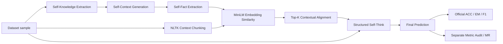

# FaithfulRAG 科研复现工程

> Knowledge Conflict · Context Faithfulness · Self-Fact Mining · Contextual Knowledge
> Alignment · Self-Think · Reproducible RAG Evaluation

[](https://github.com/XMUDeepLIT/Faithful-RAG)
[](https://aclanthology.org/2025.acl-long.1062/)


本仓库基于 FaithfulRAG 官方代码，完成了面向论文复现的工程整理、源码审计、冻结配置、数据
完整性校验、统一实验输出和无 GPU 验证。目标是在获得一张 NVIDIA 24GB+ GPU 后，先通过
严格 smoke/stability gate，再复现 FaithEval 与 MuSiQue-negative 上的核心趋势。

> [!IMPORTANT]
> 当前状态是：**复现工程已准备并通过 CPU 验证；真实 Llama-3.1-8B GPU 实验及论文数值复现
> 尚未执行。** 本仓库没有把 mock/CPU 测试包装成论文结果。

## 简历项目要点与最终验收目标

本节完整对应项目简历描述。带有“待验证”的部分是后续 GPU 阶段的验收目标，不是当前仓库
已经产生的实测结论。

- 围绕检索上下文与模型参数知识冲突导致的非忠实生成问题，复现 FaithfulRAG 的
  **Self-Fact Mining、Contextual Knowledge Alignment 与 Self-Think** 三阶段流程，并分析：
  - Context Ignorance：模型忽略检索上下文；
  - Parametric Knowledge Override：参数知识覆盖冲突上下文；
  - Fact Conflict Mixing：事实冲突混合生成。
- 基于官方代码与数据构建知识一致/冲突实验切片，最终目标为：
  - 知识一致样本 600 条；
  - 知识冲突样本 600 条；
  - 对比 Vanilla RAG、上下文提示增强、无 CoT 与分阶段 CoT；
  - 固定相同 backbone、数据顺序、context budget、generation 参数和 evaluator。
- 简历目标结果口径（**待真实 GPU predictions/metrics 验证**）：
  - 冲突样本 ACC：Vanilla RAG `58.4%` → FaithfulRAG `72.6%`；
  - 上下文忠实度：`0.63` → `0.79`；
  - 在 `RESULTS.md`、`run_manifest.json` 与原始 predictions 齐备前，不视为本仓库实测结果。
- 工程目标覆盖 OpenAI、Hugging Face 与 vLLM 推理路径，提供异步批处理、阶段 checkpoint/
  resume、结果缓存、统一实验日志与异常落盘：
  - OpenAI / Hugging Face：公开代码已有路径，本复现工程完成 wrapper 与审计；
  - vLLM：论文声明使用，但公开仓库无 backend，当前仍是待补 GPU 工程项；
  - checkpoint、结果缓存、日志、异常保存：已实现并通过 CPU/mock 测试。
- 最终错误分析目标：结合模块消融与 prediction-level 标注，量化 Context Ignorance、
  Parametric Knowledge Override 与 Fact Conflict Mixing 的数量、比例和典型 trace，并分析
  Self-Fact Mining、alignment 和 Self-Think 对各类错误的影响。

### 简历要点证据状态

| 简历要点 | 当前状态 | 达成条件 |
|---|---|---|
| 三阶段 FaithfulRAG 流程 | 工程实现与 mock 全链路完成 | 真实 8B smoke + trace 人工验收 |
| 一致/冲突各 600 条 | 待构建冻结切片 | ID manifest、sampling seed、数据 SHA256 |
| 四类方法对比 | 配置部分完成 | 补 Vanilla/提示增强并完成公平性审计 |
| ACC 58.4% → 72.6% | 待验证 | 原始 predictions、official metrics、run ID |
| 忠实度 0.63 → 0.79 | 待定义并验证 | 指标公式、scorer、逐样本 score |
| OpenAI/HF/vLLM 三后端 | OpenAI/HF public path；vLLM pending | 三后端 smoke 和版本 manifest |
| 异步、缓存、日志 | 已实现并 CPU/mock 验证 | GPU stability run |
| 三类失败模式定位 | taxonomy 已定义 | prediction-level 标注与统计报告 |

## 项目完成度

| 项目 | 状态 | 可验证材料 |
|---|---|---|
| 官方仓库、论文与核心调用链审计 | ✅ 完成 | [`REPRODUCTION.md`](REPRODUCTION.md) |
| Self-Fact Mining 三阶段控制流 | ✅ CPU/mock 验证 | `tests/test_cpu_pipeline.py` |
| Context chunking、MiniLM embedding、cosine alignment | ✅ 真实 CPU 验证 | `repro/cpu_checks.py` |
| FaithEval / MuSiQue / SQuAD 数据计数与 SHA256 | ✅ 完成 | `repro/preflight.py`、frozen configs |
| Full Context / FaithfulRAG / 两套消融配置 | ✅ 工程准备完成 | `configs/reproduction/` |
| 统一 config、prediction、metric、trace、log、异常输出 | ✅ 完成 | `repro/run_experiment.py` |
| checkpoint/resume、禁止覆盖、失败证据归档 | ✅ 完成并测试 | `tests/test_runner_outputs.py` |
| Llama-3.1-8B GPU smoke | ⏳ Pending | 需 Linux + NVIDIA 24GB+ GPU |
| FaithEval / MuSiQue 论文结果 | ⏳ Pending | 尚无真实 GPU predictions/metrics |
| vLLM 论文 serving stack | ⚠️ 未实现 | 论文称 vLLM，公开核心代码无 vLLM backend |

完整 CPU 验证记录见 [`audit/FINAL_CPU_VALIDATION.md`](audit/FINAL_CPU_VALIDATION.md)。

## 方法与调用链



- **Self-Fact Mining**：先生成模型自有知识，再生成 self-context，最后抽取事实列表。
- **Contextual Knowledge Alignment**：按句子边界聚合 context chunk，以 SentenceTransformer
  cosine similarity 对齐 self-facts 与 context，保留全局 Top-K chunks。
- **Self-Think**：使用 `[Fact Analysis]`、`[Option Matching]`、`[Context Check]`、
  `[Final Verification]` 的结构化推理 prompt 生成最终答案。
- **Evaluation**：保留作者 ACC/EM/F1 实现，同时单独保存论文文字口径 audit，不静默改 evaluator。

## 已冻结的实验

### Paper-oriented public-HF proxy

- Backbone：`meta-llama/Llama-3.1-8B-Instruct`
- Embedding：`sentence-transformers/all-MiniLM-L6-v2`
- Backend：公开代码的 Hugging Face backend；论文声明的 vLLM runner 未公开
- temperature：`0.0`
- top_p：`1.0`
- chunk size：`20`
- per-fact sentence top-k：`5`
- final unique chunk top-k：`5`
- max new tokens：`1000`
- HF concurrency：`1`
- seed：`42`

### 配置矩阵

| Config | Dataset | Method | Classification |
|---|---|---|---|
| `faithfulrag_faitheval.json` | FaithEval Counterfactual | FaithfulRAG | paper-oriented public-HF proxy |
| `fullcontext_faitheval.json` | FaithEval Counterfactual | Full Context | baseline reconstruction |
| `faithfulrag_musique_negative.json` | MuSiQue-negative | FaithfulRAG | paper-oriented public-HF proxy |
| `fullcontext_musique_negative.json` | MuSiQue-negative | Full Context | baseline reconstruction |
| `faithfulrag_squad_negative.json` | SQuAD-negative | FaithfulRAG | optional paper-oriented config |
| `ablation_no_self_think_faitheval.json` | FaithEval | w/o Self-Think | paper ablation reconstruction |
| `ablation_no_fact_mining_faitheval.json` | FaithEval | w/o Self-Fact Mining | **custom aggregate ablation** |
| `github_demo_bge_faitheval.json` | FaithEval | GitHub HF demo variant | not paper main config |

`w/o Self-Fact Mining` 是自定义整体消融，不冒充论文 Table 3 中两个局部 knowledge
externalization ablation。

## 数据完整性

| Dataset file | Count | SHA256 |
|---|---:|---|
| `datas/faitheval_data.json` | 1000 | `befa1dcce8cfb49538081f903d78c6df69115c5eed0fa4bd318b9aff6f01ffa3` |
| `datas/musique_negative.json` | 1772 | `a480349414c4d273fb3a7ee7cbc9a87e9ca4f071b95ed057810a885d37eee248` |
| `datas/musique_golden.json` | 1772 | `93818b6bfef75712a55ba918879c399456ec1ea2aa70fbb97b60fab5b52a684a` |
| `datas/squad_negative.json` | 1769 | `2b04c1109bc63b0ee21ef6e1c9e61adcedb45a2a72f6c18f77b419892d6fde0b` |
| `datas/squad_golden.json` | 1769 | `1a86db65c0070b9b332797595014b34fbc664d542c082dfab5e9f60e5ac1579d` |

Strict preflight 和正式 runner 都会强制检查配置中的 SHA256；数据变化会直接阻止运行。

## 当前无 GPU 验证

在 Windows CPU 环境已经完成：

- 6 项 unit tests；
- 8/8 config dry-run；
- 真实 `all-MiniLM-L6-v2` CPU encoding 与 cosine similarity；
- mock LLM 的 Self-Fact Mining → alignment → Self-Think → evaluation 全链路；
- config/data schema、样本数、SHA256、重复 ID 和 negative/golden 配对检查；
- import/compile/CLI、结果落盘、异常落盘、resume 和空结果汇总。

```powershell
powershell -ExecutionPolicy Bypass -File scripts/setup_cpu_test.ps1
$env:NLTK_DATA = "$PWD\.nltk_data"
.\.venv-cpu\Scripts\python.exe -m unittest discover -s tests -v
.\.venv-cpu\Scripts\python.exe -m repro.cpu_checks
.\.venv-cpu\Scripts\python.exe -m repro.preflight
```

Windows CPU 环境不代表论文软件栈；Bash、CUDA、8B model load 和 GPU generation 均未在当前
host 执行。

## 第一次 GPU 运行

要求：Linux、NVIDIA 24GB+ VRAM、推荐 64GB RAM、约 60GB 可用磁盘，并已获得 Meta Llama
模型许可。

```bash
nvidia-smi
bash scripts/setup_env.sh
export HF_TOKEN='SET_IN_CURRENT_SHELL_ONLY'
.venv/bin/python -m repro.preflight --strict
LIMIT=5 bash scripts/smoke_test.sh
```

Smoke 完成后必须人工检查 `trace_samples.json` 中至少 3–5 条样本，确认 self-facts、aligned
chunks、Self-Think input/output 和 evaluator 输入正确。随后先跑 50 条 stability test，再运行：

```bash
bash scripts/run_fullcontext_faitheval.sh
bash scripts/run_faithfulrag_faitheval.sh
```

只有 FaithfulRAG 在 FaithEval 上呈现相对 Full Context 的基本优势趋势，才继续 MuSiQue 和消融。
完整 gate 与停止条件见 [`REPRODUCTION.md`](REPRODUCTION.md#17-first-gpu-run--do-not-skip-steps)。

## 统一输出

```text
outputs/results/<dataset>/<method>/<run_id>/
├── config.json
├── dataset_manifest.json
├── environment.json
├── raw_predictions.json
├── predictions.json
├── metrics.json
├── trace.json
├── trace_samples.json
├── status.json
├── run.log
├── error.json                  # failure only
└── intermediates/             # mining/alignment methods
```

汇总已完成的 runs：

```bash
.venv/bin/python -m repro.collect_results
```

结果表字段为 `Method | Dataset | ACC | EM | F1 | MR`。官方指标与 metric audit 分开保存。

## 实验结果状态

| Method | Dataset | ACC | EM | F1 | Status |
|---|---|---:|---:|---:|---|
| Full Context | FaithEval | — | — | — | GPU not run |
| FaithfulRAG | FaithEval | — | — | — | GPU not run |
| Full Context | MuSiQue-negative | — | — | — | GPU not run |
| FaithfulRAG | MuSiQue-negative | — | — | — | GPU not run |

README 中不会预填未经本仓库 predictions/metrics 支持的实验数字。

## 复现风险与官方源码差异

重点风险包括：

1. 论文声明 vLLM，但公开代码没有 vLLM backend；
2. 公开 HF 的 temperature=0 在 Transformers 4.49 下需要兼容修补；
3. 论文使用 MiniLM，GitHub HF demo 使用 BGE；
4. 官方 ACC、论文正文和附录的文字定义不一致；
5. upstream requirements 的 NumPy pin 与 vLLM 0.6.4.post1 冲突；
6. 没有 paper-time code tag，且存在论文之后的 HF/fact-extraction 修复；
7. upstream chunking 在首句过长时可能产生 empty first chunk；该行为为忠实性而保留。

逐文件 patch 风险和保留建议见
[`OFFICIAL_CODE_MODIFICATIONS.md`](OFFICIAL_CODE_MODIFICATIONS.md)。

## 仓库结构

```text
faithfulrag/                    # 作者核心实现；仅保留经过审计的最小运行性修补
configs/reproduction/          # 八套冻结配置
repro/                         # runner、preflight、CPU checks、结果汇总
scripts/                       # 环境、smoke、正式实验入口
tests/                         # 无 GPU 控制流与输出测试
audit/                         # 最终 CPU 验证记录
REPRODUCTION.md                # 完整复现手册
HANDOFF.md                     # 会话无关的快速交接
OFFICIAL_CODE_MODIFICATIONS.md # 官方源码 diff 与结果风险
```

## 版本与来源

- Upstream repository：<https://github.com/XMUDeepLIT/Faithful-RAG>
- Frozen upstream commit：`9181b1132f2f6548775e4f992a9a44fccdd018e9`
- Paper：[*FaithfulRAG: Fact-Level Conflict Modeling for Context-Faithful
  Retrieval-Augmented Generation*](https://aclanthology.org/2025.acl-long.1062/), ACL 2025
- 本仓库当前目标：复现工程与证据链建设，不声称已完成论文级 GPU 数值复现。

本仓库保留并修改了作者公开代码。Upstream 仓库当前未提供明确 LICENSE 文件；使用和再分发时
应同时遵循原作者仓库、模型和数据集的适用条款，并引用原论文。

## Citation

```bibtex
@inproceedings{zhang-etal-2025-faithfulrag,
  title     = {FaithfulRAG: Fact-Level Conflict Modeling for Context-Faithful Retrieval-Augmented Generation},
  author    = {Zhang, Qinggang and Xiang, Zhishang and Xiao, Yilin and Wang, Le and Li, Junhui and Wang, Xinrun and Su, Jinsong},
  booktitle = {Proceedings of the 63rd Annual Meeting of the Association for Computational Linguistics (Volume 1: Long Papers)},
  year      = {2025},
  pages     = {21863--21882},
  doi       = {10.18653/v1/2025.acl-long.1062}
}
```
