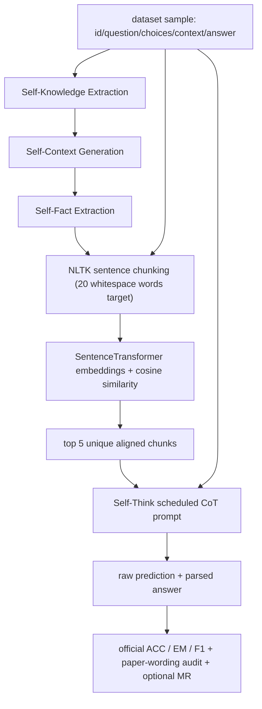

# FaithfulRAG 科研复现工程指南

本文档对应官方仓库 `XMUDeepLIT/Faithful-RAG` 的 `main` 分支 commit
`9181b1132f2f6548775e4f992a9a44fccdd018e9`；本地复现分支是
`reproduction/llama31-8b`，审计 handoff tree 是
`48086302bedf95120a5ff6166c00864eb59f9500`（checkout 后用 `git rev-parse HEAD` 确认包含
本段哈希记录的最终 docs commit）。
准备目标是：在 Linux 主机拿到一张
NVIDIA 24GB 或更大显存 GPU 后，先运行 5 条 smoke test，再执行 Llama 3.1 8B 的
FaithEval、MuSiQue-negative、Full Context 和两个消融配置。

当前状态不是“论文数值已复现”。当前无 NVIDIA GPU，已完成数据、配置、NLTK、真实
embedding、mock LLM 全链路、evaluation、CLI dry-run 和输出落盘测试；8B 模型推理与论文
结果对比仍需 GPU。

## 1. 版本与来源

- 复现工程仓库：[SikiLee/FaithfulRAG](https://github.com/SikiLee/FaithfulRAG)
- 代码仓库：[XMUDeepLIT/Faithful-RAG](https://github.com/XMUDeepLIT/Faithful-RAG)
- upstream branch/commit：`main` / `9181b1132f2f6548775e4f992a9a44fccdd018e9`
- upstream tag/release：不存在；论文对应源码 commit **UNKNOWN**。
- reproduction branch：`reproduction/llama31-8b`
- reproduction audited handoff tree：`48086302bedf95120a5ff6166c00864eb59f9500`
- 论文：[arXiv:2506.08938v2](https://arxiv.org/abs/2506.08938)（v1 2025-06-10，
  v2 2025-07-08）；[ACL 2025 Long Paper](https://aclanthology.org/2025.acl-long.1062/)
- 模型：[meta-llama/Llama-3.1-8B-Instruct](https://huggingface.co/meta-llama/Llama-3.1-8B-Instruct)，需要先接受许可并登录 Hugging Face
- 论文主实验 embedding：[sentence-transformers/all-MiniLM-L6-v2](https://huggingface.co/sentence-transformers/all-MiniLM-L6-v2)
- 数据文件已随仓库固定在 `datas/`，正式运行不从 Hugging Face 动态获取。

仓库没有 release/tag，也没有明确指出论文表格对应的 commit。当前 `main` 在论文提交后还
修过 HF `max_tokens` 和 Self-Fact Extraction prompt 等问题，因此本工程记录 commit，而不把
“当前 main”默认为论文时的精确源码快照。

## 2. 官方仓库结构与代码责任

| 路径 | 责任 |
|---|---|
| `faithfulrag/pipeline.py` | `FaithfulRAG` 门面：串联 mining、alignment、generation、evaluation |
| `faithfulrag/modules.py` | `FactMiningModule`、`ContextualAlignmentModule`、`SelfThinkModule` 的实际实现 |
| `faithfulrag/prompts.py` | 四类 prompt：self-knowledge、self-context、self-fact extraction、QA/Self-Think |
| `faithfulrag/llm/backend.py` | 后端分发与批量异步调用 |
| `faithfulrag/llm/hf.py` | Transformers `AutoModelForCausalLM.generate` 后端 |
| `faithfulrag/llm/llamafactory.py` | OpenAI-compatible LLaMA Factory HTTP 后端 |
| `faithfulrag/llm/openai.py` | OpenAI Chat Completions 后端 |
| `faithfulrag/llm/ollama.py` | Ollama HTTP 后端 |
| `faithfulrag/evaluate.py` | normalization、EM、ACC、token F1 |
| `faithfulrag/util/format_util.py` | context 清洗和 JSON answer 提取 |
| `examples/` | 四个演示；不是可追踪、可恢复的正式实验 runner |
| `repro/` | 本工程新增的 wrapper、preflight、CPU checks、结果汇总；不属于作者算法源码 |
| `configs/reproduction/` | 所有正式参数与配置来源说明 |
| `scripts/` | 环境、smoke、baseline、正式实验与消融入口 |
| `outputs/results/` | 统一实验产物 |

## 3. 模块位置与调用链



具体实现：

1. Self-Fact Mining：`FaithfulRAG.get_self_facts` 调用
   `FactMiningModule.generate_knowledges` → `generate_self_context` → `extract_facts`。
   prompt 位于 `PromptGenerator.generate_factual_knowledge`、
   `generate_context_by_factual_knowledge` 和 `generate_context_extract`。
2. Context chunking：`ContextualAlignmentModule.chunk_text` 先用
   `nltk.sent_tokenize` 分句，再以 `sentence.split()` 的空白词数累积到 `chunk_size`。
3. Embedding similarity：`calculate_similarity` 分别 encode chunks 和 self-facts，调用
   `sentence_transformers.util.cos_sim`，对每个 fact 取 `sent_topk`。
4. Contextual Knowledge Alignment：`get_contextual_chunks` 汇总候选，
   `get_topk_contextual_chunks` 按分数全局排序、去重并取 `chunk_topk=5`。
5. Self-Think：`SelfThinkModule.predict_answer_scheduled_cot` 使用带
   `[Fact Analysis] / [Option Matching] / [Context Check] / [Final Verification]` 示例的 prompt。
   这最接近论文 Figure 6；`normal_cot` 是普通 CoT，`wo_cot` 是直接回答。
6. Final generation：所有路径最终进入 `LLMBackend.generate`，HF 路径进入
   `hf_chat_completion` → tokenizer chat template → `model.generate` → decode 新 tokens。
7. Evaluation：`FaithfulRAG.evaluate` 可先用 `FormatConverter.extract_answer` 解析 JSON，
   然后对每条 answer 计算 `exact_match_score`、`acc_score`、`f1_score`。

### 从一个样本到 metric

以 `datas/faitheval_data.json` 的首条 `Mercury_7175875` 为例：

1. loader 得到问题、4 个 choices、counterfactual context、context-faithful answer
   `Planetary gravity will become stronger.`。
2. 模型先生成回答问题所需的抽象知识，再据此生成约 100 词 self-context。
3. 模型把 self-context 输出为编号 facts；作者 regex 将编号列表转成 `facts`。
4. 原 context 先删除 `<...>` 与 `[...]` 内容，再分句聚合为 chunks。
5. 每个 self-fact 与所有 chunks 做 cosine similarity，最终保留 5 个不同的最高分 chunks。
6. structured Self-Think prompt 同时接收 aligned chunks、完整原 context、问题和 choices。
7. raw generation 以 ID 为 key 保存；JSON 中 `Answer` 被解析为 prediction。
8. prediction 与数据中的 context-faithful answer 比较，生成逐样本和汇总 metric。

`repro.run_experiment` 会把上述样本的真实运行中间件保存为每次 run 的 `trace.json`，并把
全量三阶段结果保存到 `intermediates/`，所以 GPU 后不必靠日志猜测调用路径。

## 4. 论文核心配置与 GitHub demo 的差异

正式配置使用：

- Backbone：`meta-llama/Llama-3.1-8B-Instruct`
- Embedding：`sentence-transformers/all-MiniLM-L6-v2`
- temperature：`0.0`
- top_p：`1.0`（作者代码默认；论文未报告）
- generation top_k：`-1`（作者 HF backend 默认；论文未报告）
- chunk size：`20`
- aligned K：`5`
- max new tokens：`1000`（作者代码默认；论文未报告）
- seed：`42`（wrapper 固定；论文未报告，temperature=0 时主要用于环境稳定性）
- 正式 wrapper backend：`hf`
- 论文声称的 inference backend：`vLLM`

论文 Appendix B.5 明确主实验采用 `all-MiniLM-L6-v2`。GitHub HF/LLaMA Factory/Ollama
demo 使用 `bge-large-en-v1.5`，OpenAI demo 使用 `all-mpnet-base-v2`；这些不是论文主实验
配置。为保留作者 demo 变体，另有 `configs/reproduction/github_demo_bge_faitheval.json`，
但它不能标作论文主配置。

论文 Appendix C.3 声称使用 vLLM；当前公开代码却没有 `vllm` backend，只有 HF、OpenAI、
LLaMA Factory、Ollama。第一套可直接执行实验因此使用作者公开的 HF backend，并明确记录
这个执行差异。若以后要严格匹配论文 serving stack，应先向作者确认其未公开的 vLLM runner，
不能擅自把新写的 vLLM backend 称为原实现。

## 5. 数据集清单与语义

| 文件 | 样本数 | SHA256 | 用途 |
|---|---:|---|---|
| `datas/faitheval_data.json` | 1000 | `befa1dcce8cfb49538081f903d78c6df69115c5eed0fa4bd318b9aff6f01ffa3` | FaithEval Counterfactual 子集 |
| `datas/musique_negative.json` | 1772 | `a480349414c4d273fb3a7ee7cbc9a87e9ca4f071b95ed057810a885d37eee248` | 主实验 conflict context |
| `datas/musique_golden.json` | 1772 | `93818b6bfef75712a55ba918879c399456ec1ea2aa70fbb97b60fab5b52a684a` | 非冲突对照与 MR 原答案 |
| `datas/squad_negative.json` | 1769 | `2b04c1109bc63b0ee21ef6e1c9e61adcedb45a2a72f6c18f77b419892d6fde0b` | 可选 conflict 实验 |
| `datas/squad_golden.json` | 1769 | `1a86db65c0070b9b332797595014b34fbc664d542c082dfab5e9f60e5ac1579d` | 非冲突对照与 MR 原答案 |

论文说 FaithEval 全集有 4,900 条，但主实验只选 Counterfactual subset；仓库提供的 1,000 条
与这一选择一致。MuSiQue/SQuAD 使用论文所说的 longer-context subset。预检已确认两组
negative/golden 文件各自的 ID 集合和顺序完全一致。

### Negative 与 golden 不可混用

negative 文件中的 `answer` 是替换实体之后、与修改后 context 一致的答案；它可能与现实
世界事实不一致，这是 benchmark 设计，不是把真实世界答案标错。仓库
[Issue #9](https://github.com/XMUDeepLIT/Faithful-RAG/issues/9) 中作者明确回复：评估目标是模型
是否服从修改后的 context。若把 golden answer 当作 negative run 的 ground truth，会把论文的
context faithfulness 问题反过来。

## 6. 环境与兼容性

正式环境目标：Linux x86_64、Python 3.10、NVIDIA driver 支持 CUDA 12.4、24GB+ VRAM。

```bash
git clone https://github.com/XMUDeepLIT/Faithful-RAG.git
cd Faithful-RAG
git checkout 9181b1132f2f6548775e4f992a9a44fccdd018e9
# 将本复现工程的新增/修改文件应用到该 checkout 后：
bash scripts/setup_env.sh
```

或使用 Conda：

```bash
conda env create -f environment.yml
conda activate faithfulrag-repro
python -m nltk.downloader punkt punkt_tab
```

关键关系：

- `vllm==0.6.4.post1` 的发布元数据精确要求 `torch==2.5.1`、
  `torchvision==0.20.1`、`numpy<2.0.0`；见
  [PyPI vLLM 0.6.4.post1](https://pypi.org/project/vllm/0.6.4.post1/)。
- 作者 `requirements.txt` 同时固定 `numpy==2.2.6`，因此原文件本身存在 resolver 冲突，
  不能作为一套一致的 vLLM 环境安装。
- `requirements-repro.txt` 只把 NumPy 改为 `1.26.4`，保留作者的 Torch、Transformers、
  sentence-transformers、datasets、NLTK 和 vLLM 版本，并补充 HF `device_map="auto"` 所需的
  `accelerate` 与显式 `openai` 版本。
- PyTorch 2.5.1 官方提供 CUDA 12.1/12.4 安装组合；见
  [PyTorch previous versions](https://pytorch.org/get-started/previous-versions/#v251)。
- vLLM 0.6.4 是 Linux/CUDA 栈；不要在原生 Windows 上尝试正式安装。当前 Windows CPU
  检查使用 `requirements-cpu-test.txt`、Torch 2.7.1、NumPy 2.2.6，仅验证非 GPU 控制流，
  不可用于论文数值。

24GB 对 8B FP16 权重通常有余量，但 8192 输入 + 1000 输出、embedding 自动占 GPU、框架
缓存都会消耗显存。第一轮不要启用 4-bit/8-bit，因为量化会改变复现条件。若 OOM，先确认
是否有其他进程、HF 是否只加载了一份模型、输入是否异常超长；再把问题记录为资源限制，
不要无声量化后声称是原配置。

## 7. GPU 前预检与模型访问

1. 在模型页面接受 Meta 许可。
2. 设置 token：

```bash
export HF_TOKEN='YOUR_TOKEN_IN_THIS_SHELL_ONLY'
```

3. 检查数据、配置、依赖、NLTK 和 GPU：

```bash
.venv/bin/python -m repro.preflight --strict
```

4. 可选地预下载模型（首次 smoke 也会自动下载）：

```bash
.venv/bin/python -c "from huggingface_hub import snapshot_download; snapshot_download('meta-llama/Llama-3.1-8B-Instruct')"
```

## 8. Smoke test

```bash
bash scripts/smoke_test.sh
```

默认只运行 FaithEval 前 5 条，完整覆盖：模型加载、三阶段 Self-Fact Mining、NLTK chunking、
embedding alignment、structured Self-Think、generation、evaluation、trace、metrics 和文件落盘。

可覆盖样本数和 run ID：

```bash
LIMIT=10 RUN_ID=smoke-10 bash scripts/smoke_test.sh
```

如果中途失败，同一 run ID 可恢复已完成阶段：

```bash
LIMIT=10 RUN_ID=smoke-10 bash scripts/smoke_test.sh --resume
```

只有 smoke 的 `status.json` 为 `complete` 且 `error.json` 不存在时，才开始全量实验。

## 9. 正式实验命令

### FaithEval

```bash
bash scripts/run_fullcontext_faitheval.sh
bash scripts/run_faithfulrag_faitheval.sh
bash scripts/run_ablation_no_fact_mining.sh
bash scripts/run_ablation_no_self_think.sh
```

### MuSiQue-negative

```bash
bash scripts/run_fullcontext_musique.sh
bash scripts/run_faithfulrag_musique.sh
```

### 可选 SQuAD-negative

```bash
bash scripts/run_faithfulrag_squad.sh
```

通用入口：

```bash
bash scripts/run_config.sh configs/reproduction/faithfulrag_faitheval.json
```

`PYTHON_BIN`、`RUN_ID`、`OUTPUT_ROOT`、`LIMIT` 可用环境变量覆盖；其他 runner 参数直接追加。

## 10. 方法与消融定义

| 配置 method | 实际行为 | 论文地位 |
|---|---|---|
| `full_context` | 作者 no-facts few-shot QA prompt，完整 context，直接回答 | 公开代码能表达的 `Origin model with full context` 近似；仓库未提供论文 baseline runner |
| `faithfulrag` | 完整三阶段 mining + alignment + `scheduled_cot` | 第一套核心复现；scheduled prompt 与 Figure 6 最接近 |
| `no_fact_mining` | 跳过完整 Self-Fact Mining 和 alignment，以 structured scheduled-CoT 处理完整 context | 用户要求的 aggregate ablation；论文 Table 3 没有这个精确变体，不能套用论文目标值 |
| `no_self_think` | 完成 mining/alignment，把 aligned chunks 直接前置于原 context，再用直接回答 prompt | 对应论文 Appendix C.4 `w/o whole Module` |

论文 Table 3 的 Knowledge Externalization 消融分别是 `w/o Self-Context Generation` 和
`w/o Self-Knowledge Extraction`，不是整个 Self-Fact Mining 全删除。本工程不把自定义
`no_fact_mining` 冒充这两个变体。

### Frozen eight-config audit

所有 config 都明确保存：model、backend、dataset/count/hash、temperature、top_p、top_k、
max tokens、concurrency、seed、evaluation mode 和 output root。除 GitHub demo 外，共享值为：

| Field | Frozen value | Status |
|---|---|---|
| model | `meta-llama/Llama-3.1-8B-Instruct` | paper backbone |
| model requested revision | `null` | upstream public API unpinned；2026-08-08 observed `0e9e39f249a16976918f6564b8830bc894c89659` |
| backend | `hf` | public-code proxy；paper reports `vllm` |
| dtype/device/input | float16 / auto / 8192 | explicit public-HF runtime |
| generation | temperature 0.0, top_p 1.0, top_k -1, max_tokens 1000 | top_p/max tokens from author defaults, not paper-reported |
| HF concurrency | 1 | reproduction runtime guard |
| seed | 42 | wrapper audit setting, not paper-reported |
| evaluation | `author_repository_metrics_plus_separate_audit` | official top-level + separately named audit |
| output | `outputs/results` | run-specific subdirectories |

| Config | Class | Dataset file / SHA256 | Embedding | generation type | alignment |
|---|---|---|---|---|---|
| `faithfulrag_faitheval.json` | PAPER REPRODUCTION, public-HF proxy | FaithEval / `befa…ffa3` | MiniLM, observed `1110…4d41`, unpinned | scheduled CoT | chunk 20, sent top-k 5, final chunk top-k 5 |
| `faithfulrag_musique_negative.json` | PAPER REPRODUCTION, public-HF proxy | MuSiQue-negative / `a480…e248` | MiniLM, unpinned | scheduled CoT | 20 / 5 / 5 |
| `faithfulrag_squad_negative.json` | PAPER REPRODUCTION, public-HF proxy | SQuAD-negative / `2b04…de0b` | MiniLM, unpinned | scheduled CoT | 20 / 5 / 5 |
| `fullcontext_faitheval.json` | PAPER BASELINE RECONSTRUCTION | FaithEval / `befa…ffa3` | not used | direct answer | not used |
| `fullcontext_musique_negative.json` | PAPER BASELINE RECONSTRUCTION | MuSiQue-negative / `a480…e248` | not used | direct answer | not used |
| `ablation_no_self_think_faitheval.json` | PAPER ABLATION RECONSTRUCTION | FaithEval / `befa…ffa3` | MiniLM, unpinned | direct answer after alignment | 20 / 5 / 5 |
| `ablation_no_fact_mining_faitheval.json` | **CUSTOM ABLATION CONFIG** | FaithEval / `befa…ffa3` | not used | scheduled CoT without facts | not used |
| `github_demo_bge_faitheval.json` | GITHUB DEMO, NOT PAPER MAIN | FaithEval / `befa…ffa3` | BGE, observed `d4aa…e09`, unpinned | direct answer; max_tokens 500 | 20 / 5 / 5 |

完整 hash 不依赖表中缩写，均存于每个 JSON config，并由 strict preflight 和 runner 强校验。
MuSiQue/SQuAD config 还固定 paired golden SHA256。任何 hash mismatch 都是 STOP condition。

## 11. 输出与恢复

每次运行写到：

```text
outputs/results/<dataset>/<method>/<run_id>/
├── config.json
├── dataset_manifest.json
├── environment.json
├── raw_predictions.json
├── predictions.json
├── metrics.json
├── trace.json
├── trace_samples.json          # 最多 5 条，供 mandatory manual inspection
├── status.json
├── run.log
├── error.json                  # 仅失败时
└── intermediates/             # mining/alignment 方法
    ├── self_knowledges.json
    ├── self_contexts.json
    ├── self_facts.json
    └── topk_chunks.json
```

launcher 自身的 stdout/stderr 另存于 `outputs/results/_launcher_logs/`。runner 默认拒绝覆盖已有的
非空 run 目录；`--resume` 才会复用同一 run ID 下完成的阶段文件。一次失败的 run 恢复成功后，
原 `error.json` 会改名为带时间戳的 `error.previous.*.json`。不要用不同配置复用同一 run ID；
`config.json` 是最终审计依据。

汇总所有完成的 run：

```bash
.venv/bin/python -m repro.collect_results
```

输出 `outputs/results/summary.csv` 和 `summary.md`，主列为：

`Method | Dataset | ACC | EM | F1`，有 negative/golden 配对时增加 MR。

## 12. Metric 口径

作者代码会输出百分制：

- EM：normalize 后完全相等。
- F1：normalize 后 whitespace token overlap F1。
- ACC：当前代码是 `normalize(prediction) in normalize(ground_truth)`。
- MR：公开代码没有实现；wrapper 按论文定义，对 negative run 同时比较 golden original answer
  的 exact match 数 `po` 与 substituted answer 的 exact match 数 `ps`，计算
  `100 * po / (po + ps)`。

这里存在重要不一致：

1. 论文 5.1 说 prediction 只要“contains the ground truth answer”即正确，即
   `ground_truth in prediction`。
2. Appendix C.3 又说 normalize 后 prediction 与 answer “identical”，即 exact match。
3. 仓库实现方向相反，是 `prediction in ground_truth`。

因此 `metrics.json` 顶层 ACC/EM/F1 保留作者公开代码行为，同时
`paper_wording_audit` 保存 normalized equality、ground-truth-in-prediction、
prediction-in-ground-truth 和 F1 四种值。与论文表格比较前必须查看三者差异，不能只挑最接近
论文的一个口径。

## 13. 论文目标值

论文 Table 1 中 Llama 3.1 8B 的 ACC 目标：

| Method | FaithEval | MuSiQue-negative | SQuAD-negative |
|---|---:|---:|---:|
| Full Context | 63.3 | 67.8 | 69.5 |
| FaithfulRAG | 79.8 | 79.9 | 86.3 |

论文 Table 3 的 `w/o whole [Self-Think] Module`：FaithEval 50.3、MuSiQue 63.7、SQuAD
57.8；完整模型分别是 79.8、79.9、86.3。自定义 `no_fact_mining` 没有论文精确目标。

比较时先确认：相同数据 SHA、相同模型、论文 embedding、temperature=0、chunk=20、K=5、
完整样本数、无 error、同一 metric 口径。由于公开代码没有论文 vLLM runner，第一轮 HF 结果
若与表格不同，应先标为“backend/公开实现差异待查”，而不是调整参数追数。

## 14. Reproduction Risks

以下均指“可能使本地数值与论文不一致”的风险。完整官方源码 diff 见
`OFFICIAL_CODE_MODIFICATIONS.md`。

### R1 — Embedding model mismatch

- Risk: 论文 MiniLM 与 GitHub HF demo BGE-large 不一致。
- Evidence: 论文 Appendix B.5；`examples/faithfulrag_hf.py`。
- Possible impact: cosine 排序和选中 chunks 改变，进而改变 prediction/metric。
- How to detect: 检查 run `config.json`、`environment.json` 和 `trace_samples.json`。
- How to mitigate: paper config 必须使用 `sentence-transformers/all-MiniLM-L6-v2`；BGE config
  只作为 `GITHUB_DEMO_CONFIG_NOT_PAPER_MAIN` 保留。
- Blocks reproduction: 配错时 **YES**。

### R2 — Backend mismatch

- Risk: 论文声明 vLLM，公开 runner 只能直接使用 HF。
- Evidence: Appendix C.3 与公开 `LLMBackend.BACKENDS`。
- Possible impact: chat template、停止条件、数值 kernel 或 decoding 实现造成 generation 差异。
- How to detect: `config.json` 同时记录 `backend=hf` 与 `paper_backend=vllm`。
- How to mitigate: 第一套实验明确标为 public-HF proxy；不伪装 serving-stack 一致；向作者索取
  paper runner 后才新增严格 vLLM 对照。
- Blocks reproduction: 不阻止公开代码复现；阻止宣称 serving-stack-identical reproduction。

### R3 — Evaluation definition mismatch

- Risk: 公开 ACC、论文正文和 Appendix C.3 的定义不一致。
- Evidence: `faithfulrag/evaluate.py` 使用 prediction-in-ground-truth；论文正文描述
  ground-truth-in-response，附录描述 normalized equality。
- Possible impact: 同一 predictions 得到不同 ACC。
- How to detect: 比较 `metrics.json` 的 `official_code_metrics` 与 `paper_wording_audit`。
- How to mitigate: 顶层指标永远保留官方实现；audit 指标单独命名，绝不覆盖 evaluator。
- Blocks reproduction: evaluator 行为无法解释时 **YES**。

### R4 — Dependency mismatch

- Risk: upstream NumPy 2.2.6 与 vLLM 0.6.4.post1 的 `numpy<2` 冲突。
- Evidence: upstream `requirements.txt` 与 vLLM 发布元数据。
- Possible impact: 环境无法解析，或更换核心版本后产生 generation 差异。
- How to detect: `repro.preflight --strict` 和 `environment.json`。
- How to mitigate: 使用 `requirements-repro.txt`，仅把 NumPy 固定到 1.26.4；不要临时升级核心包。
- Blocks reproduction: strict dependency mismatch 时 **YES**。

### R5 — Dataset version/hash

- Risk: 相同文件名下的数据变化或错误加载 whole `datas/`。
- Evidence: 仓库数据 schema 不同；Issue #3 报告 cast error。
- Possible impact: 样本集合、顺序、answer 和 metric 改变。
- How to detect: config 固定 count/SHA256；preflight 与 runner 都会对 SHA256 不一致报错。
- How to mitigate: 只加载 config 的单一 JSON；不得绕过 hash failure。
- Blocks reproduction: **YES**。

### R6 — Current GitHub vs paper-time code

- Risk: 没有 paper tag；论文之后存在 HF 和 fact-extraction 修复。
- Evidence: `dd21b2a`（2025-09-01）修复 `max_tokens`；`ab7e75e`（2025-09-08）把 extraction
  调用改为 `generate_context_extract`；arXiv v1/v2 与 ACL 版本都更早。
- Possible impact: hidden paper runner 可能产生不同 Self-Facts 或 generations。
- How to detect: 每次 run 保存 `git_head`/`git_status`，handoff 固定 upstream commit。
- How to mitigate: 保留 current public upstream，标记 paper-time commit UNKNOWN；不要猜测回退点。
- Blocks reproduction: 不阻止公开代码实验；阻止宣称源码快照完全一致。

### R7 — HF generation and temperature zero

- Risk: local HF compatibility patch会影响 generation 行为。
- Evidence: upstream 固定 `do_sample=True` 且模块传 `temperature=0.0`；Transformers 4.49.0
  `TemperatureLogitsWarper` 对 0.0 抛 `ValueError`。当前实现改为 greedy `do_sample=False`。
- Possible impact: prediction/metric 可能与论文 vLLM 或另一未公开实现不同。
- How to detect: model sanity、smoke raw outputs、manual trace、FaithEval trend comparison。
- How to mitigate: 不更改 frozen config；先跑 5、再跑 50，最后只比较 FaithEval baseline/main。
- Blocks reproduction: patch 未经 GPU trace 验证前阻止 full run；验证后仍保留 HIGH caveat。

### R8 — Determinism and revisions

- Risk: seed 不能保证跨 HF/vLLM/GPU/kernel bitwise identical；Hub revision 未被公共 API 固定。
- Evidence: config 的 `requested_revision` 是 null，仅记录 2026-08-08 observed revision。
- Possible impact:未来下载的权重/embedding 或 kernel 输出不同。
- How to detect: 保存实际 `environment.json`，在首跑前重新查询 Hub SHA 并与 config observed 值比较。
- How to mitigate: 若 SHA 改变则停止并先决定是否 pin；temperature 0、并发 1、固定 seed。
- Blocks reproduction: checkpoint SHA 变化未审计时 **YES**。

### R9 — Negative/golden context confusion

- Risk: negative 中的 substituted answer 被误当错误标签，或用 golden answer 评 negative ACC。
- Evidence: negative/golden 文件内容和 [Issue #9](https://github.com/XMUDeepLIT/Faithful-RAG/issues/9)
  作者回复。
- Possible impact:任务定义反转、ACC/MR 失真。
- How to detect: config `context_variant`、paired ID/hash 和 prediction rows。
- How to mitigate: negative answer 作为 official ground truth；golden 只用于配对审计/MR。
- Blocks reproduction: **YES**。

### R10 — Upstream chunking/fact parsing edge cases

- Risk: chunking 首句超过 20 词时插入空首 chunk；fact regex 排除数字并可能截断年份/数值。
- Evidence: upstream `modules.py`；空首 chunk 在 FaithEval 309/1000、MuSiQue 1099/1772、
  SQuAD 1092/1769 条上出现。
- Possible impact: empty embedding 候选或截断 facts 改变 alignment。
- How to detect: 必看 `trace_samples.json` 和 `intermediates/`。
- How to mitigate: 第一套实验保留 upstream 行为；记录异常，不静默“修正”后追论文数值。
- Blocks reproduction: trace 显示 alignment 明显异常时 **YES**。

### R11 — Strict JSON parsing

- Risk: scheduled CoT 输出不是严格 JSON 时，官方 parser 将整段 raw text作为 answer。
- Evidence: `FormatConverter.extract_answer` 只调用 `json.loads`。
- Possible impact: otherwise correct generation 被计为错误。
- How to detect: 比较 `raw_prediction`、`parsed_prediction` 和 metric details。
- How to mitigate: 保留 raw；不增加宽松 parser；先统计 50-sample stability run 的 malformed outputs。
- Blocks reproduction: malformed 比例足以解释趋势异常时 **YES**。

## 15. 本工程对核心源码的最小修改

新增功能优先全部放在 wrapper。核心 diff 仅包含运行性修补：

- 把错误的顶层 `from util import logger` 改为包内相对导入。
- 移除 `format_util.py` 从未使用、却让任何 import 都强制依赖 vLLM 的 imports。
- HF backend 正确消费 `device_map`、dtype、量化 flag、max input；过滤 HF 不接受的
  `response_format`；temperature=0 时使用 deterministic `do_sample=False`。
- HF backend 默认并发设为 1，避免同一模型被 10 个线程并行调用；HTTP 后端仍默认 10。

没有改 prompt、fact regex、cosine similarity、top-k 排序、数据或 official metric；HF generation
兼容修改是明确的 result-sensitive exception，风险为 HIGH。chunking 的空首 chunk 行为已恢复为
upstream。逐文件风险、保留/回退建议与 paper-time Git
历史证据见 `OFFICIAL_CODE_MODIFICATIONS.md`。复核完整 official-source diff：

```bash
git diff 9181b1132f2f6548775e4f992a9a44fccdd018e9 -- faithfulrag/
```

## 16. 当前无 GPU 测试记录

当前机器：Windows、Python 3.13、无 `nvidia-smi`。CPU 检查使用独立验证环境，不代表论文
软件栈。

已通过：

- 6 个 JSON 数据文件加载、schema、计数、SHA256、ID 唯一性。
- MuSiQue/SQuAD negative-golden ID 集合与顺序一致。
- 8 个 config JSON 加载与 runner `--dry-run --limit 5`。
- NLTK `punkt` 与 `punkt_tab`，首条 FaithEval context 分成 17 句。
- 论文 embedding `all-MiniLM-L6-v2` 的真实 CPU encode、cosine top-2；被测首条样本没有空 chunk，
  不代表 upstream 的 R10 边界不存在。
- mock LLM 的完整 Self-Fact Mining → alignment → Self-Think → evaluation 控制流。
- official normalization、ACC、EM、F1 与 JSON answer parsing。
- 成功 run 的 config/predictions/metrics/log/trace/status 落盘及日志句柄关闭。
- `python -m unittest discover -s tests -v`：6 tests passed。

可重跑：

```powershell
powershell -ExecutionPolicy Bypass -File scripts/setup_cpu_test.ps1
$env:NLTK_DATA = "$PWD\.nltk_data"
.\.venv-cpu\Scripts\python.exe -m unittest discover -s tests -v
.\.venv-cpu\Scripts\python.exe -m repro.cpu_checks
.\.venv-cpu\Scripts\python.exe -m repro.preflight
```

Linux Bash、CUDA、8B model load 和 GPU generation 在本 Windows host 上均为：
**NOT EXECUTED ON THIS HOST**，不能标记为 PASS。

## 17. FIRST GPU RUN — DO NOT SKIP STEPS

下面是 gate，不是建议清单。任一步失败都按第 18 节停止，不能跳到 full experiment。

### STEP 1 — GPU sanity check

目标主机必须是 Linux、NVIDIA GPU、推荐 24GB+ VRAM：

```bash
nvidia-smi
```

记录 GPU 名称、显存和 driver。新机器尚无项目 Torch 时，Python 部分在 STEP 2 安装后立即执行：

```bash
.venv/bin/python - <<'PY'
import torch
print("torch:", torch.__version__)
print("torch CUDA build:", torch.version.cuda)
print("CUDA available:", torch.cuda.is_available())
if not torch.cuda.is_available():
    raise SystemExit("STOP: torch cannot access CUDA")
print("GPU:", torch.cuda.get_device_name(0))
print("VRAM GiB:", torch.cuda.get_device_properties(0).total_memory / 2**30)
PY
```

### STEP 2 — Environment setup

```bash
bash scripts/setup_env.sh
.venv/bin/python -m pip freeze > installed-first-gpu.txt
```

`installed-first-gpu.txt` 是本机记录，不要用它替换 frozen requirements。若 setup 或上面的
Torch CUDA 检查失败，停止。

### STEP 3 — Model access

先在 Hugging Face 接受 Meta Llama 许可并登录。token 只放环境变量，不写文件或命令历史：

```bash
export HF_TOKEN='YOUR_TOKEN_IN_THIS_SHELL_ONLY'
.venv/bin/python - <<'PY'
from huggingface_hub import model_info
expected = {
    "meta-llama/Llama-3.1-8B-Instruct": "0e9e39f249a16976918f6564b8830bc894c89659",
    "sentence-transformers/all-MiniLM-L6-v2": "1110a243fdf4706b3f48f1d95db1a4f5529b4d41",
}
for model, recorded_sha in expected.items():
    current_sha = model_info(model).sha
    print(model, current_sha)
    if current_sha != recorded_sha:
        raise SystemExit(f"STOP: Hub revision changed for {model}; audit before continuing")
PY
```

### STEP 4 — Strict preflight

```bash
.venv/bin/python -m repro.preflight --strict --output outputs/preflight-first-gpu.json
```

只要返回非零：**DO NOT START FULL EXPERIMENTS**。不能用非 strict 结果替代此 gate。

### STEP 5 — Model load sanity check

只加载模型并生成一条短输出，不进入数据 pipeline：

```bash
.venv/bin/python - <<'PY'
import torch
from transformers import AutoModelForCausalLM, AutoTokenizer
from sentence_transformers import SentenceTransformer

model_id = "meta-llama/Llama-3.1-8B-Instruct"
tokenizer = AutoTokenizer.from_pretrained(model_id)
model = AutoModelForCausalLM.from_pretrained(
    model_id, device_map="auto", torch_dtype=torch.float16
)
messages = [{"role": "user", "content": "Answer with exactly: GPU sanity OK"}]
text = tokenizer.apply_chat_template(messages, tokenize=False, add_generation_prompt=True)
inputs = tokenizer(text, return_tensors="pt").to(model.device)
with torch.inference_mode():
    output = model.generate(**inputs, max_new_tokens=16, do_sample=False)
print(tokenizer.decode(output[0][inputs.input_ids.shape[1]:], skip_special_tokens=True))
embedder = SentenceTransformer("sentence-transformers/all-MiniLM-L6-v2")
print("embedding shape:", embedder.encode(["sanity"]).shape)
print("allocated GiB:", torch.cuda.memory_allocated() / 2**30)
PY
```

OOM、tokenizer/model 错误或 CUDA 不可见都必须停止。

### STEP 6 — Smoke test

```bash
LIMIT=5 bash scripts/smoke_test.sh
```

此时不比较论文 ACC。确认对应 run 目录至少存在：`status.json`、`trace.json`、
`trace_samples.json`、`metrics.json`、`run.log`、`predictions.json`、`config.json`、
`environment.json`、`dataset_manifest.json`，且 `status=complete`。

### STEP 7 — Manual trace inspection

**必须人工打开 `trace_samples.json` 的 3–5 条记录。**逐条查看：question、原 context、
self knowledge、self context、self facts、top-k chunks、`self_think_input`、raw/parsed output、
final prediction 和 ground truth。确认：

- self facts 非空且没有系统性截断/格式异常；
- chunks 与问题/事实合理相关，空 chunk 没有进入 top-k；
- Self-Think input 包含预期 aligned chunks 和原 context；
- prediction 确实来自 FaithfulRAG 路径，官方 evaluator 接到正确 parsed prediction；
- 没有意外 fallback、空输出或 checkpoint 错配。

任一项明显异常：**STOP**。

### STEP 8 — 50–100 sample stability run

先跑 50 条，不要直接跑 1000 条：

```bash
export RUN_ID="stability_faitheval_50_$(date -u +%Y%m%dT%H%M%SZ)"
LIMIT=50 bash scripts/run_faithfulrag_faitheval.sh
```

检查 OOM、耗时、显存、malformed raw generations、异常落盘、checkpoint/intermediates 和日志。
用同一 `RUN_ID` 验证恢复不会重算已完成 raw predictions：

```bash
LIMIT=50 bash scripts/run_faithfulrag_faitheval.sh --resume
```

失败则保留 run 目录和 `error.json`，停止。

### STEP 9 — First formal baseline experiment

只运行 FaithEval、Llama-3.1-8B-Instruct：

```bash
bash scripts/run_fullcontext_faitheval.sh
bash scripts/run_faithfulrag_faitheval.sh
```

不要先跑 MuSiQue、SQuAD、ablation 或参数 sweep。

### STEP 10 — Compare trend before continuing

运行 `python -m repro.collect_results`，先比较论文 Full Context 63.3 / FaithfulRAG 79.8 与本地
FaithEval 结果。首要 gate 是 FaithfulRAG 是否明显优于 Full Context，而不是追求逐点一致。
若 Full Context ≈ FaithfulRAG 或 Full Context 更好，停止所有大规模实验，依次核对 checkpoint、
dataset/hash、negative/golden、embedding、backend、prompt、temperature、top-k、chunking、source
patch 和 evaluator。只有趋势可信且数值处于合理范围才继续。

### STEP 11 — Second dataset

```bash
bash scripts/run_fullcontext_musique.sh
bash scripts/run_faithfulrag_musique.sh
```

资源允许且前两套可信后，才运行 SQuAD-negative。

### STEP 12 — Ablation

主趋势复现后才运行：

```bash
bash scripts/run_ablation_no_self_think.sh
bash scripts/run_ablation_no_fact_mining.sh
```

前者是 paper ablation reconstruction；后者必须标作 custom aggregate ablation。

### STEP 13 — Result collection

```bash
.venv/bin/python -m repro.collect_results
```

生成 `Method | Dataset | ACC | EM | F1 | MR`，同时保留 `official_code_metrics` 和独立的
`paper_wording_audit`；两类指标不得混写。

## 18. STOP CONDITIONS

以下任一情况出现，立即停止后续大规模 GPU 实验：

- strict preflight failure；
- model/tokenizer/embedding load failure 或 checkpoint Hub SHA 改变；
- repeated OOM 或 CUDA/driver/torch 组合异常；
- smoke pipeline failure、缺失输出或 `status != complete`；
- manual trace 显示 self-facts、alignment、Self-Think input/output 明显异常；
- output/checkpoint/intermediate 损坏或 resume 关联了错误 run/config；
- FaithfulRAG 在 FaithEval 上没有表现出论文的基本优势趋势；
- evaluator 行为或 official/audit metric 差异无法解释；
- dataset count/SHA256 与 frozen config 不一致；
- 当前模型、embedding、backend、temperature、top-k、chunk size 等与 config 不一致。

停止后保留 `error.json`、run log、config/environment/manifest 和已完成 intermediates，不要改参数
追数，也不要继续烧 GPU 跑 ablation。

## 19. Handoff summary

已完成：仓库/论文/核心源码审阅；数据与依赖审计；正式和 demo 配置；环境脚本；统一 runner；
checkpoint/resume；smoke 与正式命令；Full Context、no-fact-mining、no-self-think；统一输出；
MR 与 metric 口径审计；CPU embedding 与 mock 全链路测试；结果汇总；风险记录。

还没有完成：Llama 3.1 8B 权重加载、GPU smoke、全量 generation、论文数值比较；论文原始
vLLM runner 不在公开仓库，无法验证其精确行为。

需要 GPU 后完成：按第 17 节执行。预期每个 run 生成 config、environment、dataset manifest、
intermediates、raw/parsed predictions、metrics、单条和 5 条 trace、log、status；失败时生成
`error.json`。

最可能的问题：Llama gated access、CUDA driver 不足、24GB 下异常长输入 OOM、模型输出非严格
JSON、公开 HF backend 与论文 vLLM backend 导致数值偏差、ACC 口径差异、negative/golden
误用。遇到这些问题时保留 run 目录和 `error.json`，不要覆盖失败证据。
